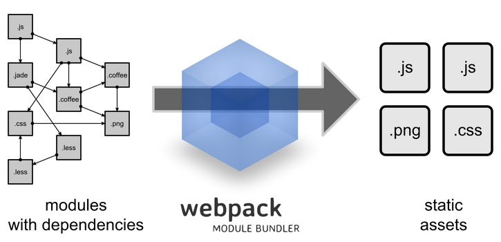

## 此项目实现过程中的学习笔记

### webpack

webpack是一个模块打包工具，将项目中的每一个文件当做一个模块，找出它们之间的依赖关系然后编译打包成可部署的静态资源。



webpack的一些功能如：

* 转换 ES2015，CoffeeScript 或者 TypeScript 模块为普通的 ES5 CommonJS 模块；
* 可以选择在编译之前检验你的源代码；
* 将 Jade 模版转换为纯 HTML 并且嵌入 Javascript 字符串中；
* 将 SASS 文件转换为纯 CSS，然后将其转换成 JavaScript 片段，将生成的 CSS 作为 <style> 标签插入页面；
* 处理 HTML 或者 CSS 中引用的图片，移动到配置的路径中，并且使用 md5 hash 重命名。


### vue-loader

vue-loader是webpack中的一个loader,可以将以下格式的编写的模块`*.vue`转换为JavaScript模块。


vue-loader的一些特性

* 默认支持 ES2015；
* 允许对 Vue 组件的组成部分使用其它 webpack loader，比如对 <style> 使用 SASS 和对 <template> 使用 Jade；
* .vue 文件中允许自定义节点，然后使用自定义的 loader 进行处理；
* 把 <style> 和 <template> 中的静态资源当作模块来对待，并使用 webpack loader 进行处理；
* 对每个组件模拟出 CSS 作用域；
* 支持开发期组件的热重载。


### vue-loader热重载

状态保留规则

* 当编辑一个组件的 <template> 时，这个组件实例将就地重新渲染，并保留当前所有的私有状态。能够做到这一点是因为模板被编译成了新的无副作用的渲染函数。
* 当编辑一个组件的 <script> 时，这个组件实例将就地销毁并重新创建。(应用中其它组件的状态将会被保留) 是因为 <script> 可能包含带有副作用的生命周期钩子，所以将重新渲染替换为重新加载是必须的，这样做可以确保组件行为的一致性。这也意味着，如果你的组件带有全局副作用，则整个页面将会被重新加载。
* <style> 会通过 vue-style-loader 自行热重载，所以它不会影响应用的状态。

关闭热重载

```javascript
module: {
  rules: [
    {
      test: /\.vue$/,
      loader: 'vue-loader',
      options: {
        hotReload: false // 关闭热重载
      }
    }
  ]
}
```


### vue-loader使用css-loader编译路径的规则

* 如果路径是绝对路径，会原样保留。
* 如果路径以 . 开头，将会被看作相对的模块依赖，并按照你的本地文件系统上的目录结构进行解析。
* 如果路径以 ~ 开头，其后的部分将会被看作模块依赖。这意味着你可以用该特性来引用一个 node 依赖中的资源：
```html
    
```
* (13.7.0+) 如果路径以 @ 开头，也会被看作模块依赖。如果你的 webpack 配置中给 @ 配置了 alias，这就很有用了。所有 vue-cli 创建的项目都默认配置了将 @ 指向 /src。


### file-loader & url-loader


### 使用vue-cli创建项目
国内使用`cnpm`安装
```
cnpm install -g vue-cli
vue init webpack-sample hello-vue
cd hello-vue
cnpm install 
npm run dev
```


### 导入其它vue组件的典型写法

```javascript
<script>
    import ComponentA from './ComponentA.vue'
    import ComponentB from './ComponentB.vue'

    export default {
        components: {
            ComponentA, // vue自动将key转换为component-a
            ComponentB
        }
    }
</script>
```


### Babel
Babel是一个JavaScript代码转换器，将ES6或更新的标准语法转换为当下普通浏览器都支持的ES5语法。`.babelrc`是babel的配置文件。
[Babel官网](https://babeljs.cn/)


### CSS Modules
CSS Modules是一个用来模块化和组合CSS的流行系统。

使用

```css
<style module>
.red {
  color: red;
}
.bold {
  font-weight: bold;
}
</style>
```

会产生一个`$style`计算属性，通过此属性引用style

```html
<template>
  <p :class="$style.red">
    This should be red
  </p>
</template>
```

---
> [vue-loader官网](https://vue-loader.vuejs.org/zh-cn/)

